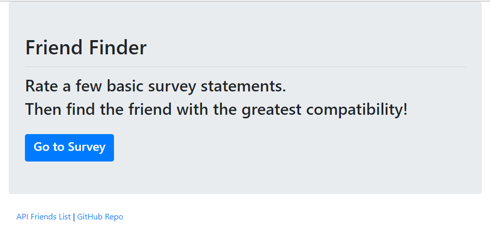
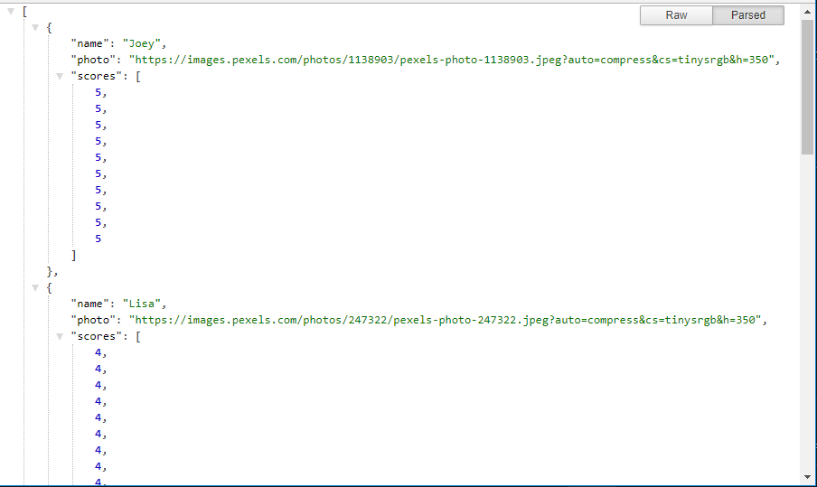

# FriendFinder
A full-stack application that will match friends based on the compatibility of their answers to a survey.

[Click here](https://safe-brushlands-91298.herokuapp.com/) to view the deployed site.

## Technologies Used:
- Node JS
- Express
- AJAX/API's
- ECMAScript 6 syntax
- HTML5
- Bootstrap 3

## How it works

### Landing page
On the landing page, you have an option to start the survey, view the raw API data, or visit the github repo for the project:

### Survey questions page
If you click on the link to the survey, you are prompted to enter your name, and a link to an image of yourself:

### Friends API page
If you click on the link to the API, this is the data you will see. It is formatted in this image by a chrome JSON formatter extension:

